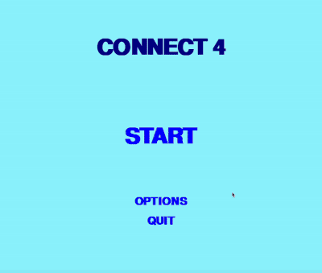

# Connect-4 (Pygame)

A simple, local implementation of Connect Four written in Python using Pygame.

## Features

- Local two-player and player-vs-AI modes (and AI-vs-AI for a fun viewing experience)
- Difficulty levels (Easy / Medium / Hard) which change AI search depth.
- Configurable board sizes (standard 7x6 and alternatives).

- Note: Increased difficulty and/or board size comes with increased waiting time vs. AI
    -> Area for future improvements*

Controls:
- Escape key to exit to menu or go back
- Click for everything else

## Codebase

  - `game.py` — main game and UI functions
  - `board.py` — board representation and search logic
  - `utils.py` — minimax algorithm, scoring function, transposition table, and move possibilities
  - `button.py` — simple button object for menus

- Minimax-based AI
    - Configurable search depth (exponential growth based on # of columns and open slots)
    - Alpha-beta pruning
    - Move sorting
    - Transposition table (trading memory for time)
- Pygame UI with many input procedures
- Extensible architecture to add variants

Topical videos: 
- https://www.youtube.com/watch?v=DV5d31z1xTI
- https://www.youtube.com/watch?v=ec5mluJnWM0

## Areas for future development

- Improving object modulization
    - Move menu items to different file/object
- Config for global variables/constants
- Iterative deepening for BFS style search instead of DFS
    - Shortcuts for easy moves by creating a cutoff value
- Add more variants/customization

